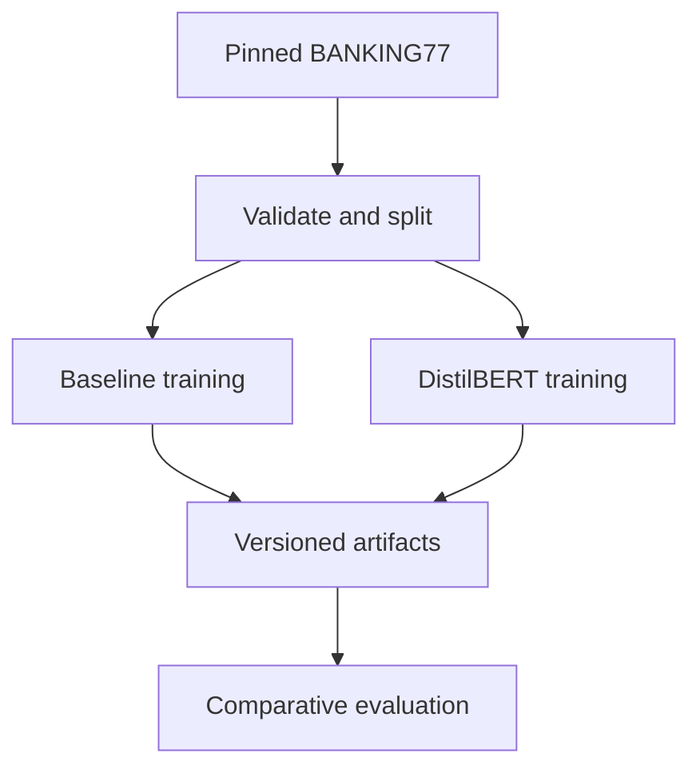
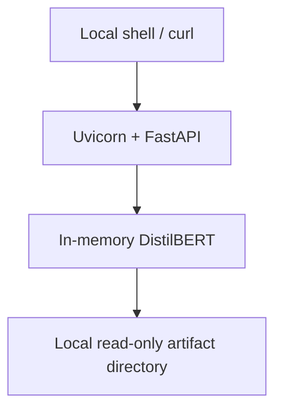

# Minimal Architecture

## Architecture decision

IntentGuard is a **modular monolith**: one Python package, local artifacts, and
one FastAPI process. Training and evaluation are offline commands using the same
package modules as inference.

This is the smallest architecture that separates data, modeling, evaluation,
artifacts, and serving without introducing service-to-service failure modes.

## Major components

| Component | Responsibility | Must not do |
|---|---|---|
| Configuration | Load versioned TOML settings and environment overrides | Contain secrets or machine-specific absolute paths |
| Data module | Download, validate, split, and expose typed examples | Train models or mutate the upstream test split |
| Baseline module | Fit/save/load TF-IDF logistic regression | Share fitted state with the transformer |
| Transformer module | Tokenize, fine-tune, save/load, and infer | Select thresholds from test labels |
| Evaluation module | Calculate metrics, risk/coverage, latency, and reports | Rewrite model artifacts or invent missing results |
| Artifact module | Validate local bundle structure and provenance | Act as a model registry |
| API module | Validate requests, invoke the loaded predictor, translate errors | Train models or download data at request time |
| Logging module | Emit privacy-conscious structured events | Log raw input text at INFO level |

## Data and training flow



### Preparation flow

1. Resolve the pinned dataset revision.
2. Validate required fields, types, label names, duplicates, and split
   membership.
3. Preserve the upstream test split.
4. Stratify a validation split from upstream training data with the configured
   seed.
5. Write metadata containing source, revision, licence, counts, label-map hash,
   split seed, and created file hashes.

### Baseline training flow

1. Load validated train and validation examples.
2. Fit TF-IDF on training text only.
3. Fit logistic regression on training labels.
4. Evaluate on validation.
5. Save the pipeline and provenance.
6. Evaluate the frozen artifact on test during `make evaluate`.

### Transformer training flow

1. Load the pinned tokenizer and base model.
2. Tokenize using the configured maximum sequence length.
3. Fine-tune only on training examples.
4. Select the best epoch by validation macro-F1.
5. Generate validation probabilities.
6. Select the abstention threshold from validation data.
7. Save model, tokenizer, threshold, label map, configuration, and provenance.

## Inference flow


1. FastAPI/Pydantic validates the JSON body.
2. Middleware attaches or validates a request ID.
3. The predictor tokenizes text using the loaded tokenizer.
4. The model produces logits; softmax produces class probabilities.
5. The maximum probability is compared with the saved threshold.
6. The API returns `accept` with an intent or `abstain` with a null intent.
7. A structured event records non-sensitive metadata and elapsed time.

The service never downloads a model, trains, changes a threshold, or writes
request content during inference.

## Evaluation flow

1. Validate that baseline and transformer reference the same dataset revision,
   label-map hash, and test IDs.
2. Load the untouched test split.
3. Produce probabilities and predictions for both models.
4. Calculate task metrics.
5. Apply the already-saved transformer threshold.
6. Calculate selective metrics and risk/coverage points.
7. Benchmark single-item inference after warm-up.
8. Run the unsupported-query fixture separately.
9. Write immutable run outputs under a timestamped evaluation directory.
10. Render a Markdown comparison from the machine-readable JSON.

## Failure handling

| Failure | Boundary behavior |
|---|---|
| Dataset revision unavailable | Fail data command with source and retry guidance; do not use an unpinned substitute |
| Dataset contract mismatch | Fail before training and show violated fields/counts |
| CUDA unavailable | Use configured CPU path or stop with a clear training-time warning |
| CUDA out of memory | Stop; retry once using documented fallback batch configuration |
| Corrupt/incomplete artifact | API startup fails; `/health` must not report ready |
| Label-map mismatch | Reject artifact at startup |
| Empty or oversized request | Return stable 422 error without inference |
| Inference runtime error | Return stable 500 error with request ID; log category, not raw text |
| Evaluation mismatch | Fail rather than compare non-equivalent runs |
| Unsupported query above threshold | Return the model decision; document this limitation rather than silently overriding it |

## Local execution topology

Only one runtime process exists during serving:



Offline data, training, and evaluation commands run separately. Concurrent
training and serving are explicitly unsupported.

## Proposed implementation repository

```text
intentguard/
├── README.md
├── AGENTS.md
├── LICENSE
├── Makefile
├── pyproject.toml
├── uv.lock
├── .env.example
├── .gitignore
├── configs/
│   └── default.toml
├── src/
│   └── intentguard/
│       ├── __init__.py
│       ├── api.py
│       ├── artifacts.py
│       ├── baseline.py
│       ├── config.py
│       ├── data.py
│       ├── errors.py
│       ├── evaluation.py
│       ├── logging.py
│       ├── metrics.py
│       ├── schemas.py
│       ├── threshold.py
│       ├── training.py
│       └── predictor.py
├── scripts/
│   ├── prepare_data.py
│   ├── train_baseline.py
│   ├── train_transformer.py
│   ├── evaluate.py
│   └── demo.py
├── tests/
│   ├── fixtures/
│   │   ├── tiny_intents.jsonl
│   │   └── unsupported_requests.jsonl
│   ├── contract/
│   ├── integration/
│   └── unit/
├── evals/
│   └── README.md
├── docs/
│   ├── REQUIREMENTS.md
│   ├── ARCHITECTURE.md
│   ├── ML_SYSTEM_DESIGN.md
│   ├── TEST_STRATEGY.md
│   ├── LIMITATIONS.md
│   └── adr/
└── .github/
    └── workflows/
        └── ci.yml
```

Generated `data/`, `artifacts/`, and `reports/` directories are gitignored.
Each contains a small tracked README describing expected contents.

## Infrastructure justification

| Element | Decision | Justification |
|---|---|---|
| FastAPI | Include | Provides typed validation and a clear interview boundary |
| Local artifacts | Include | Sufficient for one model and one developer |
| `uv.lock` | Include | Reproducible dependency resolution |
| GitHub Actions | Include | Lightweight CPU validation |
| Docker | Exclude from MUST | GPU/WSL packaging consumes time without improving the core demonstration |
| Database | Exclude | No persistent online data exists |
| Model registry | Exclude | One local artifact and provenance JSON are sufficient |
| Monitoring stack | Exclude | Structured logs and measured evaluation are proportional |

