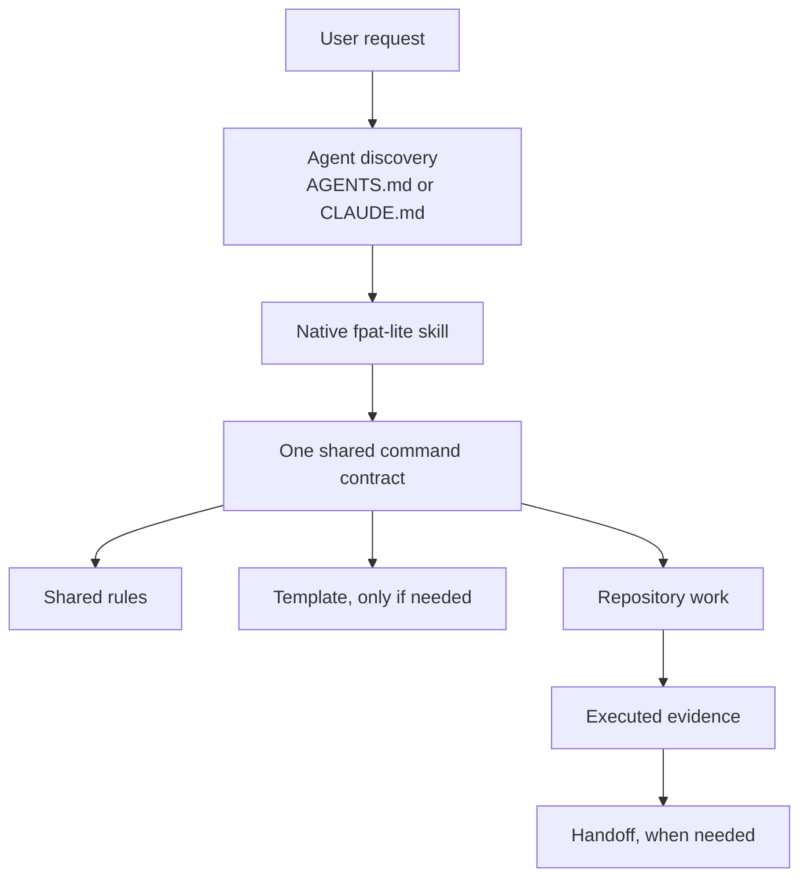
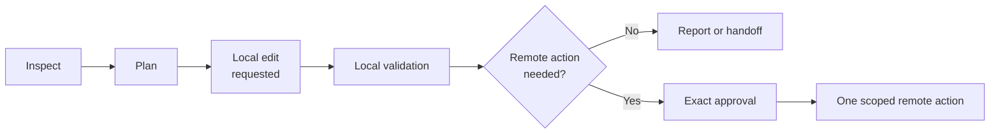

# FPAT Lite architecture

**Purpose:** Define components, responsibilities, sources of truth, and
boundaries.

**Intended reader:** Maintainers and agents planning an adaptation.

**Consult this when:** Deciding where new guidance belongs or whether an
extension is justified.

## System in one view



No server, database, daemon, model provider, or GitHub Project is part of the
core.

## Components

| Component | Responsibility | Consumer | Load behavior |
|---|---|---|---|
| `AGENTS.md` | Codex discovery, common objective, routing | Codex and humans | Startup |
| `CLAUDE.md` | Import shared instructions and add Claude-specific routing | Claude Code | Startup |
| `.agents/skills/fpat-lite/` | Codex-native reusable workflow entry | Codex | Metadata first, body on use |
| `.claude/skills/fpat-lite/` | Claude-native `/fpat-lite` entry | Claude Code | Metadata first, body on use |
| `commands/` | Six model-independent operating contracts | Any agent or human | One file per mode |
| `rules/` | Stable safety and engineering invariants | All modes | Core subset before work |
| `templates/` | Shapes for persistent artifacts | Humans and agents | Only when saving |
| `knowledge-base/` | Rationale, research, troubleshooting | Maintainers and agents | On demand |
| `scripts/` | Deterministic structure/content/package checks | Maintainers and CI | Explicit |
| `extensions/` | Optional GitHub conveniences | Teams that choose them | Never required |

## Sources of truth

FPAT Lite uses several narrow sources rather than one giant master prompt:

| Question | Source of truth |
|---|---|
| What behavior is requested? | Current user request |
| What repository rules apply? | Active agent instruction chain |
| How should this mode run? | `commands/<mode>.md` |
| What safety invariant applies? | `rules/` |
| What is the current code state? | Repository files and Git state |
| What was approved? | Current conversation and saved plan |
| What actually passed? | Current command output |
| How should a later session resume? | `.fpat/handoff.md`, rechecked by `prime` |

A plan or handoff is a checkpoint, not unquestionable truth. A new session must
compare it with live repository and remote state.

## Mutation boundary



Planning never implies implementation. Local implementation never implies
commit or push. Preparing a PR description never implies creating the PR.

## Artifact model

Use stable, overwrite-in-place working files:

```text
.fpat/request.md
.fpat/brainstorm.md
.fpat/plan.md
.fpat/validation.md
.fpat/handoff.md
```

Git history, when available, preserves evolution. Stable names make discovery
and resume predictable. Tiny tasks may need none of these files.

## Extension test

Add a new component only when all are true:

1. It solves a repeated observed problem.
2. A command, rule, or existing repository tool cannot solve it simply.
3. Its consumer and source of truth are clear.
4. It has a validation and removal path.
5. Core operation remains possible without it.

